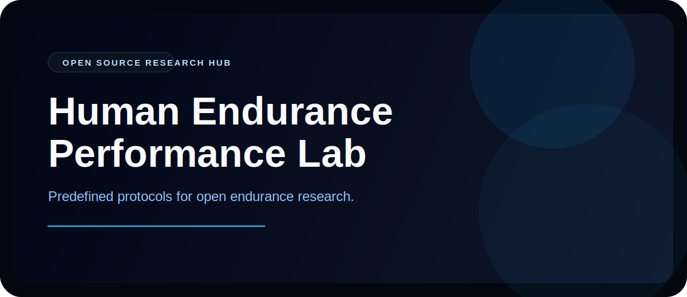

<p align="center">
  
</p>

<p align="center">
  <strong>Human Endurance Performance Lab</strong>
</p>

<p align="center">
  Open-source infrastructure for protocol-driven endurance research.
</p>

<p align="center">
  <a href="#why-this-exists">Why</a> ·
  <a href="#predefined-protocols">Protocols</a> ·
  <a href="#how-it-works">How It Works</a> ·
  <a href="#quick-start">Quick Start</a> ·
  <a href="#collaboration">Collaboration</a> ·
  <a href="#project-map">Project Map</a> ·
  <a href="#open-research-direction">Open Research Direction</a>
</p>

## Why This Exists

Most endurance research tooling is fragmented.

- Data capture lives in ad hoc forms, spreadsheets, and device exports.
- Study protocols exist in PDFs or lab notes instead of reusable software flows.
- Athlete monitoring products usually hide the logic instead of exposing the model and assumptions.

This repo is the opposite direction: a shared open-source hub where endurance studies can be run through predefined protocols, captured consistently in the field, and scored through transparent modeling.

| Principle | What it means here |
| --- | --- |
| `Protocol-first` | Every capture flow is a predefined protocol, not an unstructured form. |
| `Open science` | The model, assumptions, and outputs stay visible and inspectable. |
| `Field-ready` | The app is built for repeated real-world use, not only controlled lab sessions. |
| `Shared infrastructure` | Capture, sync, extraction, and scoring live in one reusable stack. |

## Predefined Protocols

The current hub is organized around short, structured study actions:

| Protocol | Why it exists |
| --- | --- |
| `Morning check-in` | Captures resting HR, RMSSD, sleep, weight, soreness, motivation, mood, and energy as a daily baseline. |
| `Evening mental load` | Adds cognitive and psychosocial stress inputs that endurance studies often miss. |
| `Training session import` | Pulls FIT, GPX, or TCX sessions into a consistent import queue for downstream parsing and modeling. |
| `Performance anchors` | Stores periodic benchmark tests that recalibrate interpretation over time. |
| `Model review` | Exposes architecture, equations, results, and research questions directly in the interface. |

This matters because democratizing endurance research is not just about open code. It is about making the protocol itself operational, reusable, and easy enough to run repeatedly.

## How It Works

```text
participant inputs
  -> predefined protocol flow in the Expo app
  -> local SQLite storage
  -> optional Supabase sync
  -> Python extraction + modeling pipeline
  -> readiness snapshots, latent states, and study-ready structured data
```

## What You Actually Get

| Surface | What it does |
| --- | --- |
| `Dashboard` | Shows readiness score, confidence, latent states, contributor breakdown, and recent structured sessions. |
| `Capture hub` | Routes the user into protocolized morning, evening, session, and anchor workflows. |
| `Model screen` | Explains the endurance model with architecture, equations, parameter recovery, and research hypotheses. |
| `History + sync` | Tracks local import jobs and manually syncs pending data into Supabase. |
| `Backend worker` | Extracts session features, fits the fatigue model, and writes scored outputs back into the study pipeline. |

## Quick Start

### Mobile app

```bash
npm install
npm run start
```

Useful scripts:

```bash
npm run ios
npm run android
npm run web
npm run typecheck
```

### Python backend

```bash
python3 -m pip install -r backend/requirements.txt
python3 -m unittest backend.tests.test_pipeline
python3 -m backend.sport_science.worker --limit 5
```

If you want to understand the system quickly, start with the app capture flows and the model screen. That is where the protocol layer and the scientific framing are most visible.

## Collaboration

Supabase infrastructure and access credentials are not published in this repository.

- If you want to collaborate on the study hub, protocols, or deployment setup, contact `per.c.wesseø@gmail.com`.
- If you want to contribute code without hosted access, you can still work on the app, protocol flows, model layer, and local-first data pipeline in this repo.
- Infrastructure access is shared selectively for active collaborators.

## Research Model

This project is not trying to be a vague wellness tracker. It is trying to make endurance-performance research easier to run in the open.

- Four latent states are tracked explicitly: aerobic fatigue, neuromuscular fatigue, central fatigue, and fitness.
- The model screen documents state dynamics, observation loadings, synthetic parameter recovery, and fixed-vs-state-dependent recovery comparisons.
- The `science/` directory holds the research prototypes and reference materials that seeded the production-facing mobile UI and backend model code.
- The scoring layer is meant to stay inspectable so researchers can challenge assumptions, swap protocols, and compare alternative formulations.

## Project Map

```text
app/                    Expo Router screens and navigation
components/             Shared UI primitives and panels
hooks/                  App data hooks
lib/                    Sync logic, storage, formatting, Supabase helpers, model visualization data
types/                  Shared TypeScript domain types
backend/                Python package, extractor/model code, and tests
science/                Research prototypes and experimental scripts
supabase/migrations/    SQL schema for remote sport_science_* tables
db/                     Local SQLite bootstrap helpers
```

## Open Research Direction

The long-term point of this repo is bigger than a single app:

- Make endurance study protocols reusable in software instead of burying them in documents.
- Lower the friction for solo researchers, coaches, labs, and athletes to gather longitudinal data.
- Standardize repeated field capture without forcing everything into a black-box commercial product.
- Build a community-owned base layer for endurance monitoring, protocol execution, and transparent modeling.

## Data Flow Notes

1. The mobile app captures athlete profile data, daily states, mental load, anchors, and session files.
2. Records are stored locally first and marked for sync.
3. Sync pushes structured rows and file payload references into Supabase.
4. The backend worker extracts features, fits the fatigue model, and produces readiness outputs.

## Database

Apply the Supabase schema in [supabase/migrations/20260306020000_sport_science_schema.sql](./supabase/migrations/20260306020000_sport_science_schema.sql).

All remote tables are prefixed with `sport_science_`.
